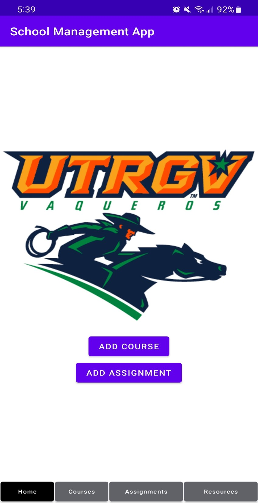

# School Management App (Fall 2022 Project)

My teammates and I wanted to create something that would be useful to students, so we decided an app was the best way to bring that idea to fruition. We have created a school management app for Android using Android Studio. We made sure that our app would be easily accessible, user-friendly and efficient to ensure that students receive good service. We spent a lot of time researching databases and Android Studio to maximize the efficiency of our app. We went through several drafts of the app before landing on our current version which we designed to be as simplistic as possible. I contributed to the functionality of the app, the access to the databases of the app and the programming of the buttons and movements.

## How it works
   
Once launched, the user will be redirected to the home page where he can choose to add a course by clicking on the “ADD A COURSE” button and add an assignment by clicking on the “ADD ASSIGNMENT” button. Students will enter course or assignment descriptions and click the "Add Course" or "Add Assignment" buttons respectively. Once courses and assignments are added, they will be saved in the app's database and the student can access them at any time using the navigation bar at the bottom of the homepage. 

Please see below a demo of the app

https://user-images.githubusercontent.com/103907426/220515270-8db164df-d9f1-4530-8d5d-f835a933f120.mp4

## Future works

Our app is at its basic stage. In the future, we plan to add more features to the app to sort assignments by due date, associate assignments with courses, and push notifications.
